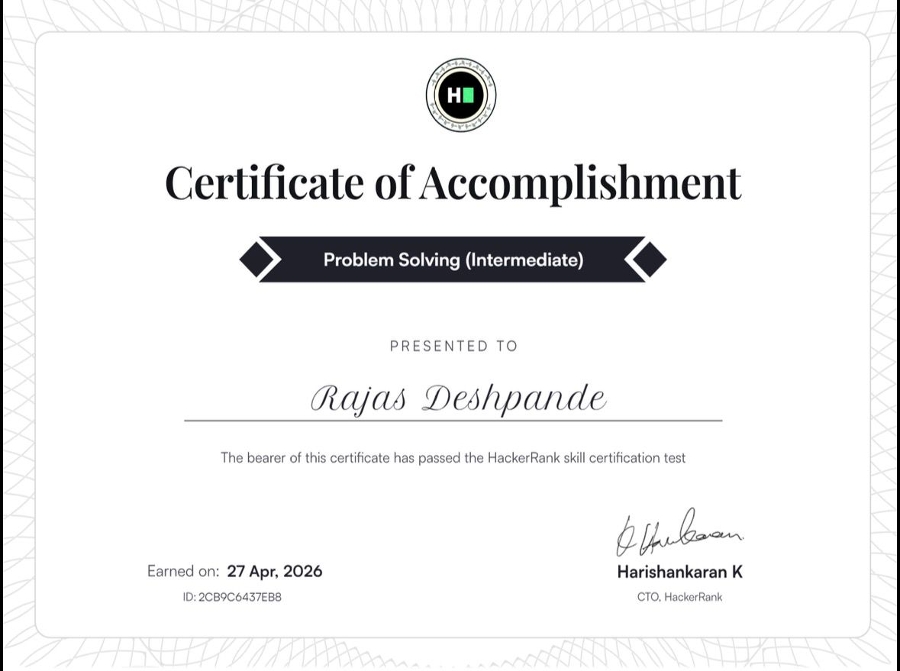
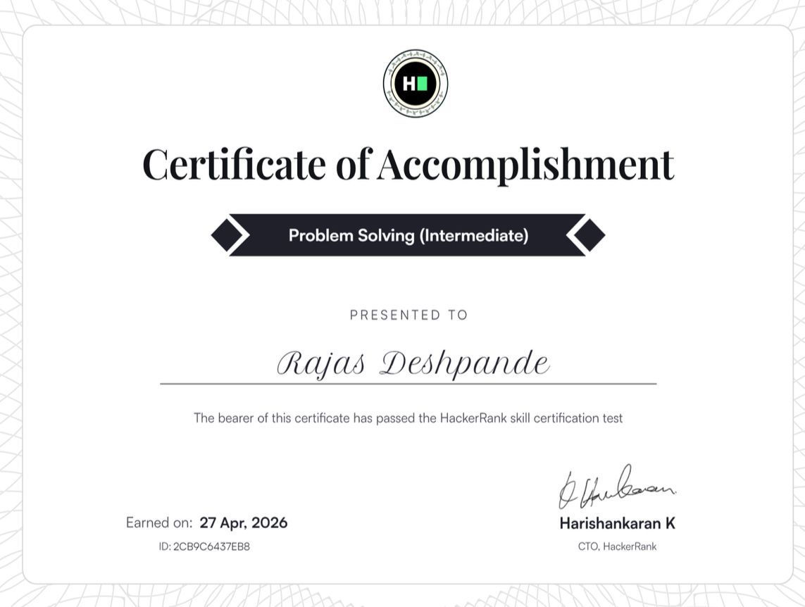
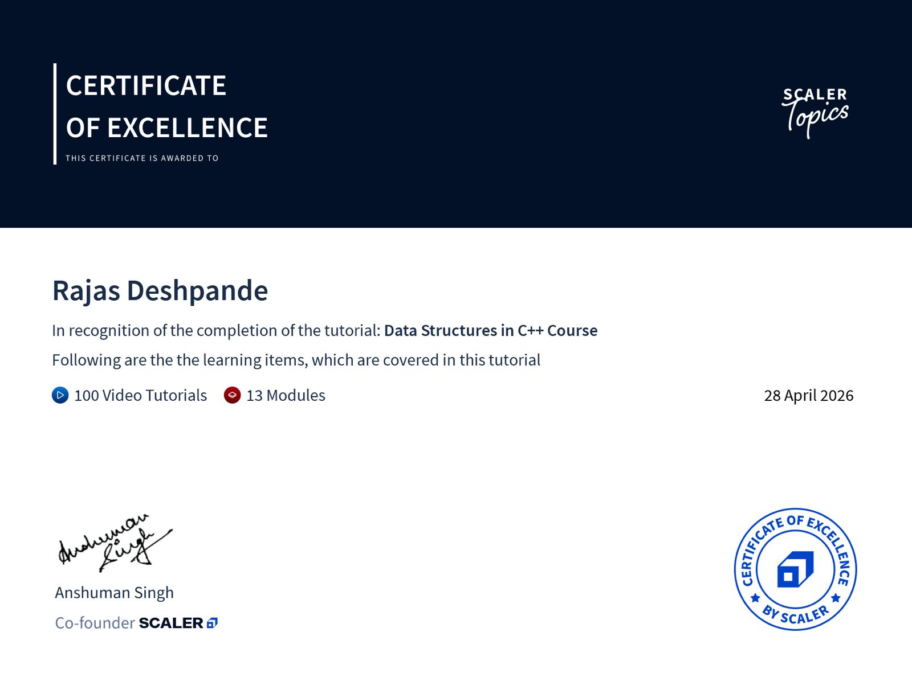
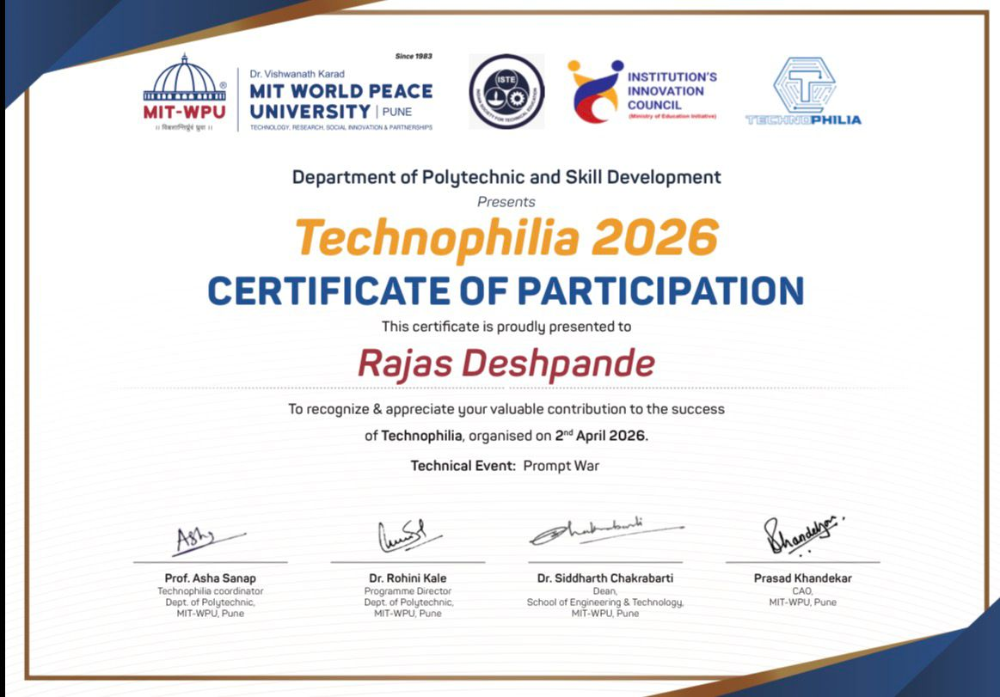

# 🏆 Competitive Programming (CP) Lab

This repository contains my experimental work and problem-solving journey for the **Competitive Programming** course at MIT WPU. It includes structured lab experiments and solutions to various challenges.

---

### 📜 Certification Gallery

| HackerRank Profile Snapshot | Problem Solving (Basic) |
| :---: | :---: |
| <a href="Screenshot%202026-04-27%20234658.png"></a> | <a href="Problem_Solving_Basic.jpeg"></a> |

| Problem Solving (Intermediate) | Scaler DS in C++ |
| :---: | :---: |
| <a href="Problem_Solving_Intermediate.jpeg"></a> | <a href="Scaler_DSCPP.jpeg"></a> |

| Technophilia Event |
| :---: |
| <a href="Technophilia.jpeg"></a> |

---

## 🧪 Experiments
- **Experiments 1–12**: Organized into individual folders, including all the concepts taught throughout the semester.
- **Certifications**: Included my official HackerRank assessment certificates for Problem Solving and Scaler DataStructures in CPP certificate.

---

## 💻 HackerRank Profile and Certifications

[](https://www.hackerrank.com/profile/rajasmd_2008)

- ⭐ **5★ in C++**
- 🎯 **Problem Solving (Basic)** Certified 
- 🎯 **Problem Solving (Intermediate)** Certified
- 🎯 **SCALER Data Structures in C++ Course** Certified
---

## 📂 Repository Structure

```
├── EXPERIMENT 01/
├── EXPERIMENT 02/
├── EXPERIMENT 03/
├── EXPERIMENT 04/
├── EXPERIMENT 05/
├── EXPERIMENT 06/
├── EXPERIMENT 07/
├── EXPERIMENT 08/
├── EXPERIMENT 09/
├── EXPERIMENT 10/
├── EXPERIMENT 12/
├── CpNotebook+Certificates_RollNo...    # Combined Course Document + Certicates
├── Problem_Solving_Basic.jpeg           # HackerRank Basic Certificate
├── Problem_Solving_Intermediate.jpeg    # HackerRank Intermediate Certificate
├── Scaler_DSCPP.jpeg                   # Scaler Data Structures Certificate
├── Screenshot 2026-04-27 234658.png     # HackerRank Profile Snapshot
├── Technophilia.jpeg                    # Event Certificate
├── problem_solving_basic_certificate... # Original PDF/Source
├── problem_solving_intermediate_ce...   # Original PDF/Source
└── README.md                            # Repository Doccumentation
```
